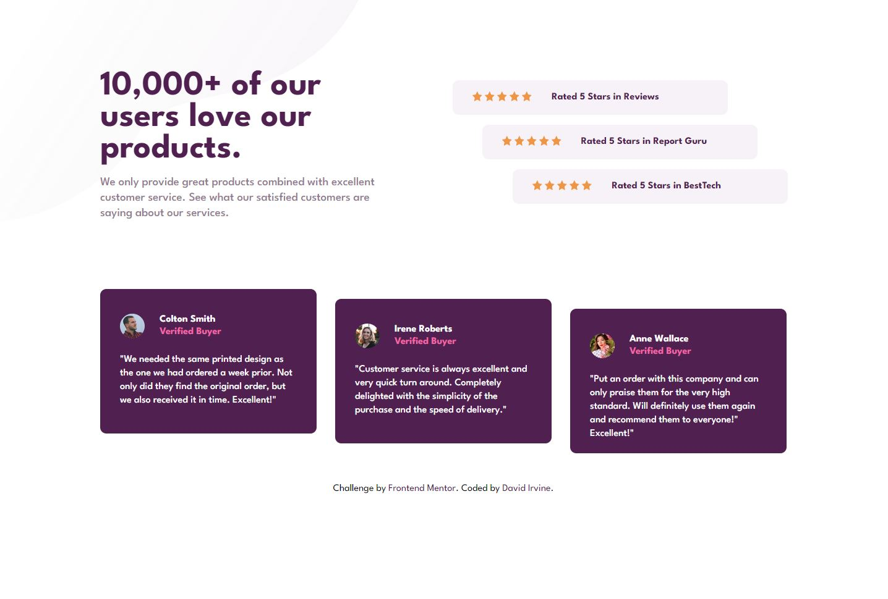

# Frontend Mentor - Social proof section solution

This is a solution to the [Social proof section challenge on Frontend Mentor](https://www.frontendmentor.io/challenges/social-proof-section-6e0qTv_bA). Frontend Mentor challenges help you improve your coding skills by building realistic projects. 

### Screenshot

### Links

- Solution URL: [solution URL](https://github.com/DavidIrvine-TW/Social-proof-section)
- Live Site URL: [live site](https://davidirvine-tw.github.io/Social-proof-section/)

### Built with

- Semantic HTML5 markup
- CSS custom properties
- Flexbox
- CSS Grid
- Mobile-first workflow

## Author

- Website - [@David Irvine](https://github.com/DavidIrvine-TW)
- Frontend Mentor - [@David Irvine](https://www.frontendmentor.io/profile/DavidIrvine-TW)
